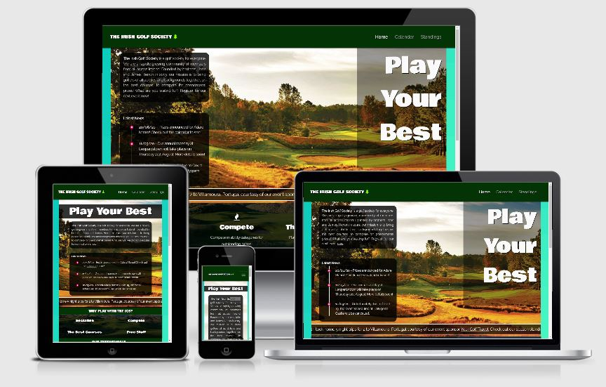
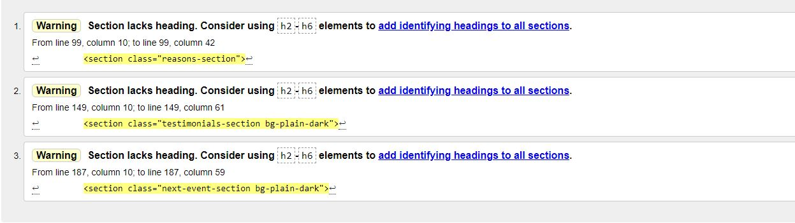
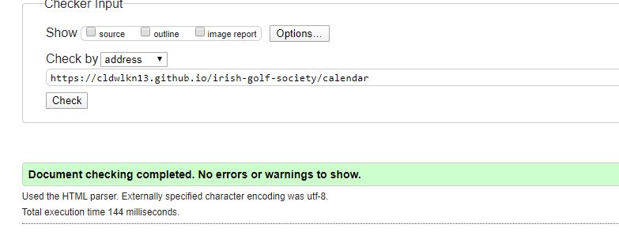
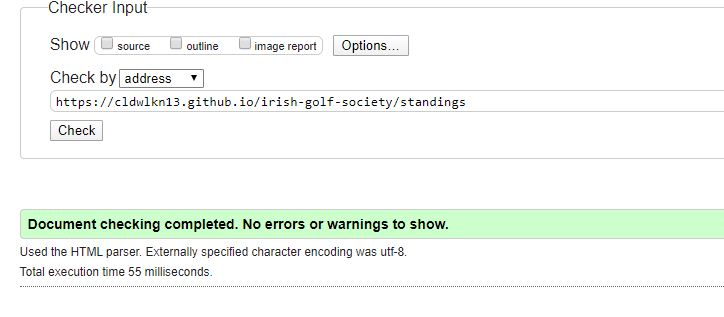
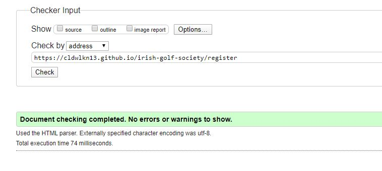

# The Irish Golf Society

## Who are we?

The Irish Golf Society is a fictional Golf society, organising premium Golf days, in a long running societal format. The main ethos for the society is to encourage golfers of any ability/background to enjoy great experiences in friendly and inclusive environment. 

Founded by two brothers, John and James (?) who felt as though there was a niche in the market for golfers who wanted the opportunity to play premium courses for much better value than was being offered in the open market.

To provide context, they have devised the following networking business model:

1. Collaborate with the most forward-thinking premium Golf Clubs around to purchase blocks of tee-times for discounted prices (by economies of scale) in advance. 
2. Collaborate with key players in the Golf market to provide great prizes through sponsorship. 
3. Aggressively market the society and it's benefits/ethos through postering in clubs and a website. 
4. Gain traction for community growth through word of mouth/social media from participants regarding enjoyment/value/fulfillment of events attended/prizes won/free stuff accrued.
5. Greater number of community players involved = greater purchasing econmies of scale/greater value for sponsors.

The future vision for the society is the evolve into a "Club" type of organisation. Where members pay a yearly fee, and can not only play organised events but can play premium courses on a significant discount from the open market. 

The website can be viewed [here]().

## Why do the IGS need a website?

1. As a marketing tool to new potential players.
2. An interface to register for an event of the user's choosing through the registration form.
3. Source of society news.
4. Results/Leaderboard information for existing participants. 
5. Sponsorship affiliation.

## User Stories 

- As the society director, I want to be able to attract new players to register for an event. 
- As the society director, I want to ensure that my sponsors are well represented where possible and their homepages can be easily navigated to. 
- As the society director, I want the user to be able to find the information they require quickly through well designed naviagtion.
- As the society director, I want the user to be able to access our social media links easily from each page. 
- As a potential customer, I want to see the benefits of why I should register for an event.
- As a potential customer, I want to see what other people have been saying about their experiences with the IGS. 
- As a potential customer, I want to be able to see what events are upcoming. 
- As a potential customer, I want to be able to see where I can contact the IGS to ask a question. 
- As an existing customer, I want to be able to see my results and position on the leaderboard. 
- As an existing customer, I want to be able to get directions to the course where I will be playing. 
- As a sponsor, I want to see that my brand is being promoted on the site. 
- As a Golf Club owner, I want to see the event scheduled is being promoted. 

## Wireframes

Wireframes were designed using Microsoft Powerpoint and images of the slides can be viewed in the following table:

|    Desktop   |    Tablet    |    Mobile    |
|    :----:    |     :----:   |    :----:    |
|[Home Page](assets/wireframes/homepage-desktop.JPG)|[Home Page](assets/wireframes/homepage-tablet.JPG)|[Home Page](assets/wireframes/homepage-mobile.JPG)|
|[Calendar](assets/wireframes/calendar-desktop.JPG)|[Calendar](assets/wireframes/calendar-tablet.JPG)|[Calendar](assets/wireframes/calendar-mobile.JPG)|
|[Standings](assets/wireframes/standings-desktop.JPG)|[Standings](assets/wireframes/standings-tablet.JPG)|[Standings](assets/wireframes/standings-mobile.JPG)|

---

## Site Features 

**Header** contains
- **Society Name/Logo** Easily identifiable branding
- **Responsive Navigation Bar** Facilititates site navigation in a common intuitive way.
*The header is fixed at the top of each page, always visible. 

**Footer** contains
- **Key Sponsor Links** Branded links to the IGS key sponsors, allowing users to navigate to their homepages in new tabs. 
- **Social Media Links** Links to the societies social media accounts (actual accounts for the IGS do not exist).
- **Contact details** Address, email (with mailto link) & phone number to contact the IGS. 
*The footer is available at the bottom of each page

**Home Page** contains
 - **About Us** to provide a little bit of background about the society
 - **Latest News** so users can easily log on and see any developments
 - **Marketing/Testimonials** so potential customers can be attracted to register for an event
 - **Next Event - Call to Action** so all users can easily see what the next upcoming event is and register for it. 

**Calendar** contains
  - **List of Upcoming Events** each containing
    - **Directions** so users can physically navigate to the course via Google Maps
    - **Call to Action** so users can register for an event
    - **Prize Informstion** so that users can see the exciting prizes on offer if they register

**Standings** contains
  - **Men's Leaderboard table** so Men can see their position on the leaderboard
  - **Ladies' Leaderboard table** so Ladies can see their position on the leaderboard

**Register Form**
  - **HTML5 form** so a user can input all the relevant information to register for an event. 
  
## Feature Roadmap

**Register Form**
 - Form should select the correct event in the event dropdown depending on the source of the click. 
 - Form should persist information to a database upon submit. 
 - User should be notified of action success/fail.
  
 ## Technologies

**Development:**
- [GitHub](https://github.com/) - site host.
- [Gitpod](https://gitpod.io/) - dev IDE.

**Key content and styling:**
- [HTML5](https://en.wikipedia.org/wiki/HTML5) site content
- [CSS3](https://en.wikipedia.org/wiki/Cascading_Style_Sheets) site styling
- [Bootstrap](https://getbootstrap.com/) - project layout & additional styling

**Supplementary technologies**
- [Google Fonts](https://fonts.google.com/) - source of fonts for the site.
- [Font Awesome](https://fontawesome.com/) - various Icons for abstract marketing as well as social media branding
- [Am I Responsive?](http://ami.responsivedesign.is/) - responsiveness visualisation.

## Testing

**HTML Validtion**
- **Home Page**
 
 *The errors listed above were ignored as the headings for this page were handled in a different manner.
 
- **Calendar**
 
 
 - **Standings**
 
 
 - **Register**
 

## Deployment

**To deploy**

The Irish Golf Society is hosted on **GitHub Pages**

1. In the GitHub repository select **Settings**.
2. The **Pages** section is 75% down the page, scroll here. 
3. In the **Source** dropdown menu select **master**.
4. The website is now deployed.

**To clone from Github**

1. In the Github repository click the green **Code** button.
2. Select clone protocol of your choice (SSL/HTTP/CLI)
3. Go to your IDE.
3. Open **Git Bash**.
4. Change the current working directory to the location where you want the cloned directory to be made.
5. Type **git clone**, and then paste the URL copied from GitHub.
6. Press **enter** and the local clone will be created.

## Credits
As this project is ficticious, the majority of the content was imagined and devised by myself. 

[W3Schools](https://www.w3schools.com/) 

The pictures of the Golf courses are taken from the individual websites of the real courses mentioned in this site. 

## Acknowledgments

[Precious Ijege](https://www.linkedin.com/in/precious-ijege-908a00168/?originalSubdomain=ng) for all his support and guidance.

I would also like to thank Susan for their feedback and support through this process!

